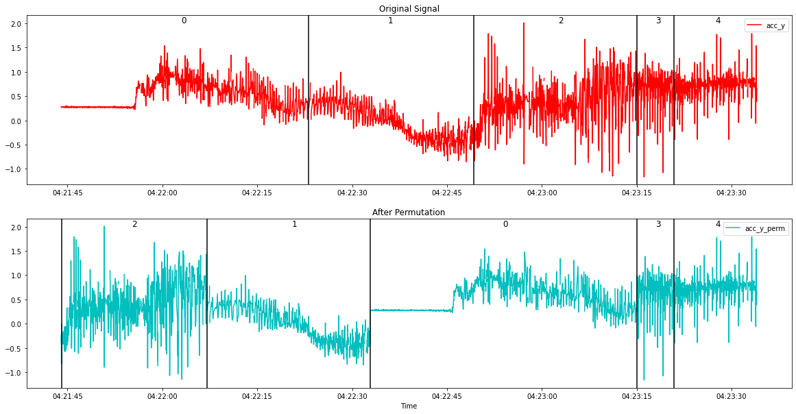
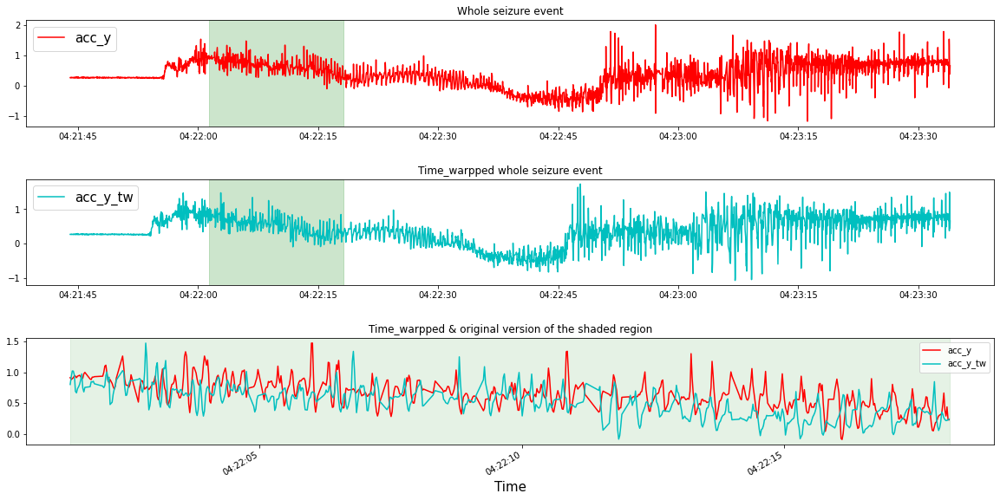
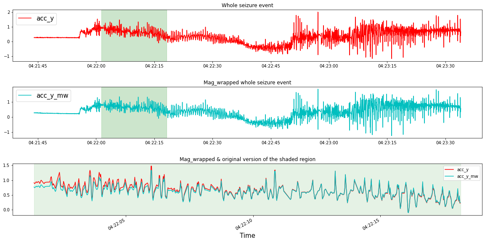
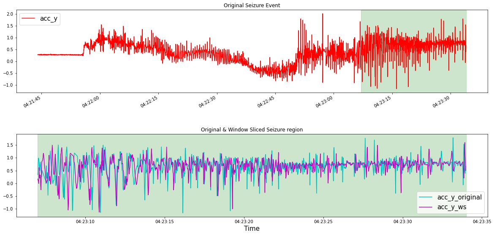
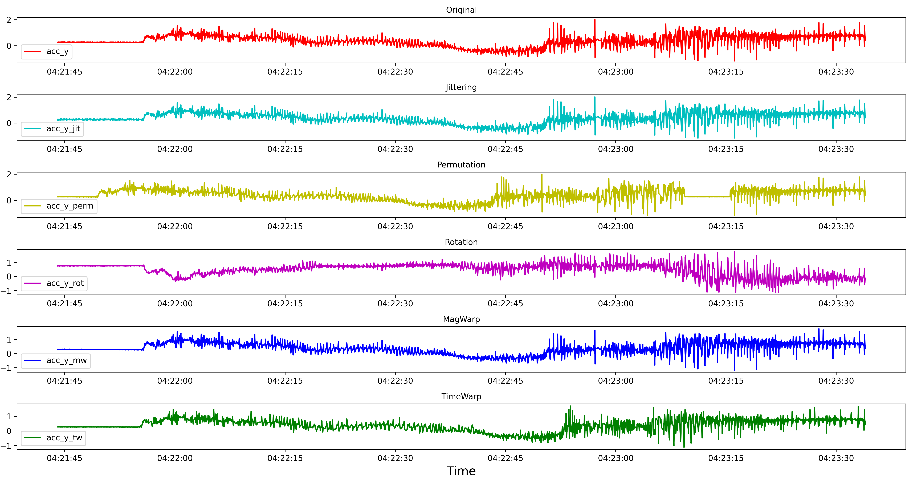
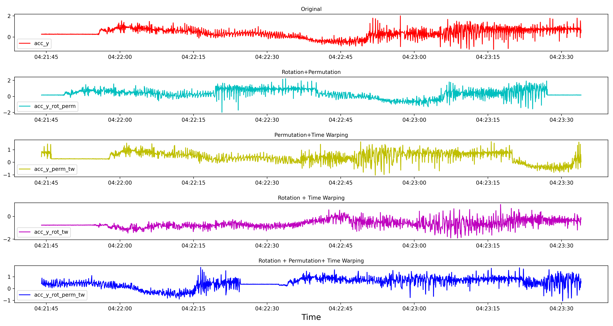
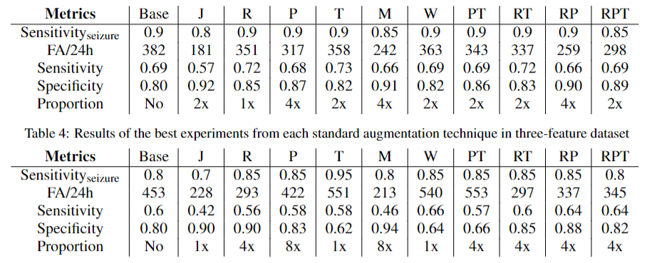
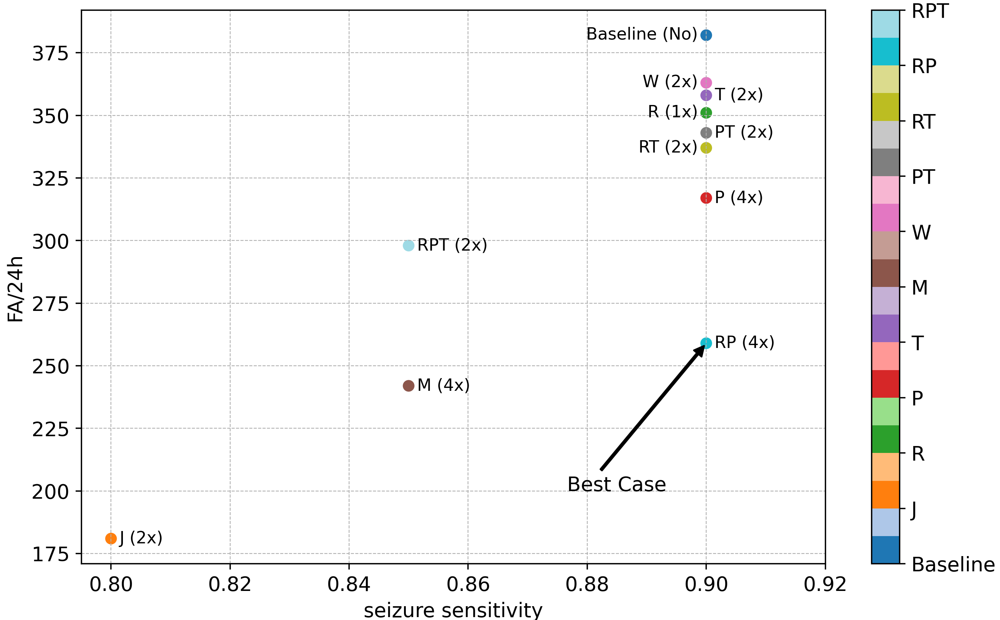
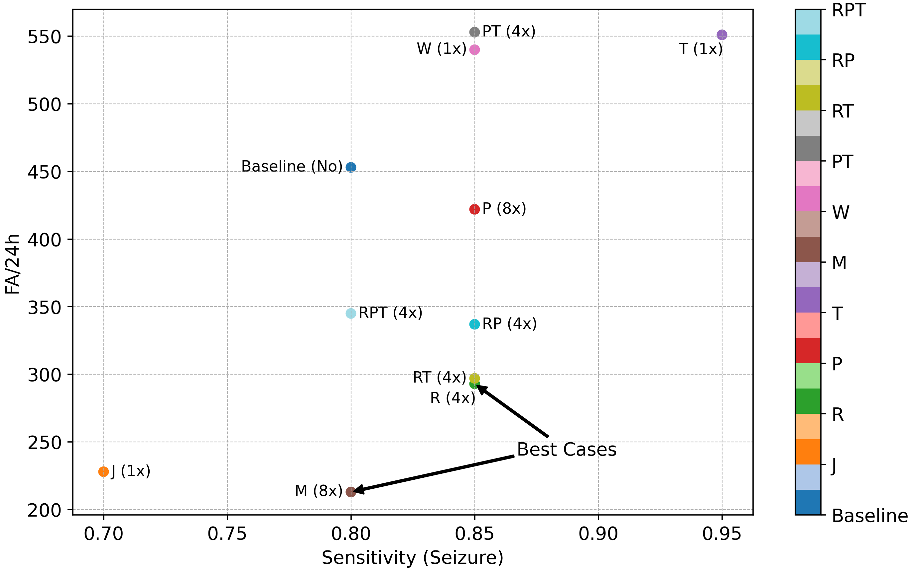

## Data Augmentation in Epileptic Seizure Detection based on 3D Acceleration, Heart Rate and Temperature

Epilepsy, characterized by recurrent seizures, poses a significant risk to the individual’s safety. To mitigate
these risks, one approach is using automated seizure detection systems based on Convolutional Neural Networks
(CNNs) which rely on large amounts of data to train effectively. However, real-world seizure data
acquisition is challenging due to the short and infrequent nature of seizures, resulting in a data imbalance.

In this work, data augmentation techniques: Standard time series data augmentation techniques and Generative Adversarial Networks
(GANs) - based augmentation is utilized to increase the training dataset for CNNs, aiming for high sensitivity and low false alarm rates in the detection of epileptic seizures. For this purpose, the wearable sensor dataset is prepared into two datasets,

*-  **five features (3D acceleration, heart rate, and temperature)*** 

*-  **three features(only 3D acceleration)*** are used.

  
 For results comparison, CNN trained without augmented data is used
 as a baseline. 
 
Since my master's thesis involves extensive research and implementation, it's not feasible to include all the details here. I've included the code files for Augmentation via GANs. However, the detailed results and implementation are not covered here. Please refer to the **[presentation](defense_masterthesis.pptx)**. for a general overview.

### Data Augmentation
Data augmentation is a technique that artificially increases the size of a dataset by creating
modified versions of existing data. It is particularly helpful in the context of imbalanced
dataset distributions commonly found in real-world applications. It allows additional
data to be generated for underrepresented classes, creating a more balanced dataset.
Studies have shown that data augmentation techniques can improve the generalizability
of deep learning networks, thereby reducing overfitting and enabling the networks to handle
imbalanced datasets more effectively.
These techniques include basic approaches that involve random transformations in
the time, frequency, and magnitude domains and advanced approaches that use Generative
Adversarial Networks (GANs) to generate synthetic time series.

### Standard Augmentation techniques

While the choice of data augmentation techniques depends on the
dataset’s properties and the task at hand, several basic techniques have been identified in
the area of time series data. Synthetic samples are generated by applying certain transformations
to the original samples, such as :

*- adding random noise (jittering)*

*- applying warping in time and magnitude (time warping, magnitude warping)*

*- rearranging segments (permutation) within the time series*

*- applying rotation matrices (rotation)* or

*- slicing (window slicing).*

Examples of random-transformation-based (standard) time series
data augmentation techniques are shown in the Figure below. 

**Implementation of Standard Augmentation techniques and augmented sample plots via each technique is available under the [Notebook](aug_plots.ipynb).**

These methods are applied to the extracted seizure events and the augmentation
process transforms the original seizure events to produce new synthetic samples. The original
seizure samples could contain missing time stamps, and the transformation is applied, 
including those missing time stamps. Following the augmentation, the augmented seizure
samples are divided into 10-second windows without any overlap ( samples for CNN training). The interpolation of
missing values is only performed during windowing after the samples have undergone a
transformation in the augmentation process. In contrast to the 15% interpolation threshold
used in the original data, the interpolation threshold is kept as low as 10% to preserve
more real data points of the augmented sample.

#### Jittering
Noise is generated from a normal distribution with a mean of 0 and chosen standard deviation values of 0.2 and 0.5 to examine the effect of low and high noise levels on the performance of the
models. Choosing the right standard deviation ensures the jittered data reflects the original time series. A standard deviation that is too large may distort the data, while too small may not add enough diversity.

#### Rotation
Rotation is one of the augmentation techniques that can be applied only to acceleration
data in this work due to the label-invariant characteristics of different wearable sensor
placements among participants. For example, a reversed placement of the sensor can flip its readings while maintaining the same labels for the acceleration data. In this case, rotational
augmentation can be employed as a way of simulating various sensor placements. However, this approach is not suitable for heart rate and temperature data because
inverting their sign can result in changes to the label, generating unrealistic data.

#### Permutation
In the implementation of Permutation, the original seizure sample is rearranged into a new
time series by dividing it into a specified number of segments and rearranging the order of
the segments randomly. The number of segments N and the minimum segment length are both defined hyperparameters.
In this work, N is tested at values of 2, 3, and 5, while the minimum segment
length is fixed at 10.

#### Time Warping
The time warping is applied to the original time series sample by smoothly distorting the
time steps. First, the smooth cubic spline is generated using the knots with a mean of 0 and
a standard deviation of 0.2. The cumulative graph is formed using the cumulative sum
of the cubic splines and the scaling is done to match the original sample size. The final
cumulative time stamps are then used to perform linear interpolation on the original
acceleration data to generate the time-warped version of the data.

#### Magnitude Warping 
Magnitude warping involves modifying the magnitude or amplitude of the original signal
by convolving it with smooth warping curves. These warping curves are generated using
a cubic spline interpolation method and their shape is determined by a set of randomly
generated knots and the shape of input data. In this work, the number of knots is 4, and
they are generated from a random normal distribution with a mean of 1 and a standard
deviation of 0.2.

Since the sampling frequency 3D acceleration data is different from heart rate and temperature
data, applying Magnitude Warping will require resampling of heart rate and
temperature data. Resampling the heart rate and temperature data to the same frequency
as the acceleration data and applying magnitude warping to all five features can result
in unrealistic values for heart rate and temperature. Furthermore, Magnitude Warping applied to the resampled data could result in further distortions. After resampling the
heart rate and temperature back to their original frequency for CNN training, the accuracy of the data could
be even further impacted. Since this operation might not result in reliable data for heart
rate and temperature, Magnitude Warping is not applied to these features. (same applies for Time Warping and Window Slicing)

#### Window Slicing
Window slicing is an augmentation technique in time series analysis that selects a portion of the data as a representative window. In this approach, the data is cropped to 90% of its original length, with the starting point chosen randomly and 10% removed from either end. For direct comparison with other methods, the cropped series is interpolated back to its original length.

Examples of standard time series data augmentation techniques applied to the y-axis
of 3D acceleration time series presented in a single plot.

#### Combination of techniques 

• Permutation + Time Warping

• Rotation + Permutation

• Rotation + Time Warping

Examples of a combination of standard time series data augmentation techniques applied
to the y-axis of 3D acceleration time series presented in a single plot.

### Results

Experiments are conducted by training a Convolutional Neural Network (CNN) with augmented data
in various proportions. The evaluation metrics are obtained for both five-feature and three-feature datasets.
For comparison, baseline results are derived by training the CNN without any augmented data.
First, to determine the best-performing augmented
data setting ( data proportions and hyperparameter
setting ) for each augmentation technique, the experiments that result in a higher seizure sensitivity than
the baseline with a lower false alarm than the baseline is selected. Moreover, if a technique can only
achieve the same level of seizure sensitivity as the
baseline while reducing the false alarm rate (less than
the baseline), it is considered the best case for that
technique. If, for a technique, there are multiple best
cases, the experiment with the highest seizure sensitivity and lowest false alarm rate is chosen as the best
case. Moreover, the best-case performance is also
presented for the techniques that did not show any
improvement to the baseline. The table summarizes the
best-case results of CNN model performance trained
with augmented data from different standard augmentation techniques on the five-feature scenario. The table presents the seizure and window sensitivity, false
alarm rate per 24 hours, and specificity values for the
best cases. The proportion of augmented data used
during the training is also shown. Additionally, the ”Base” column provides the baseline (without data
augmentation) results for comparison.

*Comparison based on seizure sensitivity and FA/24h of standard augmentation techniques
in **five-feature** dataset*

The figure represents the relationship between
seizure sensitivity and false alarm rate FA/24h for various techniques in the five-feature scenario. Seizure
sensitivity is represented on the x-axis, while FA/24h
is shown on the y-axis. Each dot represents a technique and the color corresponds to the technique’s label. The plot compares the different
techniques based on sensitivity and false alarm rate.

It can be seen that W, T, R, PT, RT, P, and RP achieve
the same high seizure sensitivity as the baseline with
a lower false alarm rate than the baseline. J, M, and RPT yield lower FA/24h at the expense of low (less than baseline) seizure sensitivity. The black arrow on
the plot points to the Rotation and Permutation (RP)
combination, which shows the best performance by
achieving the lowest false alarm rate (259 FA/24h) at
a high seizure sensitivity of 0.9. Using 1x and 4x proportions yields the same baseline seizure sensitivity
at lower FA/24h (except Magnitude Warping, (M)).
Using 2x proportion of augmented data from W, T,
PT and RT result in high (same as baseline) seizure
sensitivity. This proportion yields a low (lower than
baseline) seizure sensitivity in RPT and J techniques.
However, the false alarm rate is lower than the baseline with all the augmentation techniques. The 4x proportion leads to a lower false alarm rate than others.

*Comparison based on seizure sensitivity and FA/24h of standard augmentation techniques
in **three-feature** dataset*

The figure displays the relationship between seizure
sensitivity and false alarm rate per 24 hours for various techniques in the three-feature scenario.

T, PT,
W, P, RP, RT and R achieve a higher seizure sensitivity than the baseline. However, the false alarm rate is
very high (greater than the baseline) for W, PT, and T,
while it is lower (less than the baseline) for P, RP, RT
and R. Using RPT and M augmentation techniques
yields the same seizure sensitivity as the baseline at
lower false alarm rate (less than the baseline). Moreover, Jittering (J) yields a significantly low seizure
sensitivity at a lower false alarm rate. Time Warping (T) gives the highest seizure sensitivity of 0.95
with a relatively increased false alarm rate. Magnitude warping (M) performs the best in terms of the
lowest false alarm rate among all other techniques at
the same seizure sensitivity as the baseline. On the
other hand, Rotation (R) achieves the best result with
higher seizure sensitivity at a lower false alarm rate
than the baseline. Using 4x and 8x proportions lead to a lower false alarm rate than baseline with a higher
or the same seizure sensitivity as baseline (except PT
with high FA/24h). Using 1x proportion results in
lower seizure sensitivity at low FA/24h (Jittering (J))
or higher seizure sensitivity at high FA/24h (W and
T).

### Discussion

All standard time series data augmentation techniques (except T) have a higher seizure sensitivity
in the five-feature case as compared to when they
are used in the three-feature case. However, considering the detection improvement from their baseline version, no technique in the five-feature case
has produced more seizure sensitivity than its baseline (90%). In contrast, all the techniques (except
J, M, and RPT) in the three-feature case have given
higher seizure sensitivity than its baseline (80%). Using Time-Warping in a three-feature case, a seizure
sensitivity of 95% is achieved, which is overall the
highest among all the techniques in both three-feature
and five-feature cases. 

Using standard augmentation techniques, the average false alarm rate for the five-feature case is approximately 304 FA/24h. This is notably lower than the average false alarm rate of 377 FA/24h observed
in the three-feature case. Since the lower false alarm
means that more non-seizure windows are classified
accurately, it is observed that, as a result, the average
specificity with all techniques in the five-feature case
is 87%, which is higher than the average specificity of
80% observed in three-feature scenarios. The window
sensitivity for all the techniques in the five-feature
case, averaging 68.6%, is also higher than those of
the three-feature case, which has an average window
sensitivity of 57.3%.
Training with augmented data increases the quantity of seizure data in the training set. As classes are
balanced before training, this also leads to a corresponding increase in the number of non-seizure samples in the training set. The false alarm rate is reduced with most augmentation techniques because
the model has been exposed to more non-seizure samples during training, enabling it to more accurately
predict non-seizure samples in the test set. Considering this, if more original seizure data is available, training the model with a combination of original and synthetic data would be more beneficial in
lowering the false alarm rates without decreasing the
sensitivity.

### Summary 
Most standard time series data augmentation techniques lowered the false alarm rate in both the three-
and five-feature dataset cases. The seizure sensitivity remained constant in the five-feature case, while it
showed improvement in the three-feature case when
compared to the CNN result that did not use any augmented data.
In the five-feature dataset, the most effective
augmentation approach was achieved by utilizing a
combination of Rotation and Permutation techniques
(RP), whereas in the three-feature dataset, the best results were obtained by employing Rotation (R) and
Magnitude Warping (M) techniques. In the five-feature case, the combination of Rotation and Permutation (RP) achieves the same seizure sensitivity as
the baseline (90%) while reducing the false alarm rate
by 123 FA/24h. In the three-feature case, Rotation
(R) increases the seizure sensitivity by 5% (from 80%
to 85%) while reducing the false alarm rate by 160
FA/24h (from 453FA/24h to 293FA/24h). The aforementioned results were observed when the synthetic
data obtained from the most effective techniques (4x:
with an amount four times larger than the original
data) was combined with the original dataset, which
was used for CNN training.

