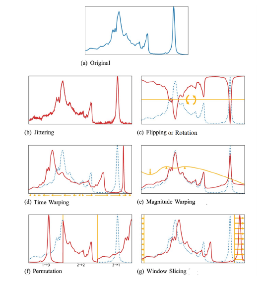

in progress....

## Data Augmentation in Epileptic Seizure Detection based on 3 Acceleration, Heart Rate and Temperature

Epilepsy is a widespread disease characterized by repeated epileptic seizures, which can
pose a serious risk to the individual’s safety and lead to life-threatening injuries. One approach
to reduce this risk is by using automated seizure detection systems, which can alert
caregivers or medical professionals to the occurrence of a seizure. State-of-the-art seizure
detection systems, such as those based on Convolutional Neural Networks (CNN), rely on
large amounts of data to train effectively. However, obtaining real-world seizure data is
a costly and time-consuming process, and the duration of actual seizure activity during
extended EEG recordings is typically quite short, often lasting only seconds or minutes.
As a result, the available dataset for training these systems is often highly imbalanced,
with far more non-seizure data than seizure data.

In this work, data augmentation techniques are utilized to increase the data available for
the project and train the CNN for seizure
detection, with more available data to achieve high sensitivity and a low false alarm rate in
the detection of epileptic seizures with motor components.
Therefore, two datasets are created from the original data:
-  with five features (3D Acceleration in x, y, z direction, heart rate and temperature)
-  with only three features (only 3D Acceleration in x, y, z direction)

Standard time series data augmentation techniques and Generative Adversarial Networks
(GANs) - based augmentation is applied to the seizures available inside the dataset.
The CNN trained without augmented data is used as a baseline to compare improvements
that have been made using the augmented data.

### Data Augmentation
Data augmentation is a technique that artificially increases the size of a dataset by creating
modified versions of existing data. It is particularly helpful in the context of imbalanced
dataset distributions commonly found in real-world applications. It allows for additional
data to be generated for underrepresented classes, creating a more balanced dataset. Several
studies have shown that data augmentation techniques can improve the generalizability
of deep learning networks, thereby reducing overfitting and enabling the networks to handle
imbalanced datasets more effectively.
  Various data augmentation techniques are available, ranging from basic to more advanced
methods, such as deep generative models. Like data augmentation techniques used for
images, many data augmentation techniques for time series are also based on the random
transformation of the training data. However, due to a diverse amount of time series with
each having different characteristics, not each technique applies to every dataset.
  Recent surveys have highlighted the potential of time series augmentation techniques to
enhance the performance of deep learning models while also improving the quality of the dataset.
These techniques include basic approaches that involve random transformations in
the time, frequency, and magnitude domains and advanced approaches that use Generative
Adversarial Networks (GANs) to generate synthetic time series.
### Short theoretical background of Standard Augmentation techniques

While the choice of data augmentation techniques depends on the
dataset’s properties and the task at hand, several basic techniques have been identified in
the area of time series data. Synthetic samples are generated by applying certain transformations
to the original samples, such as :
- adding random noise (jittering)
- applying warping in time and magnitude (time warping, magnitude warping)
- rearranging segments (permutation) within the time series,
- applying rotation matrices(rotation) or
- slicing (window slicing).
  
In the medical field, using these techniques and their combinations for acceleration data
has been shown to improve the performance of deep learning algorithms for time series
classification tasks. Examples of random-transformation-based (standard) time series
data augmentation techniques are shown in the Figure below. 

