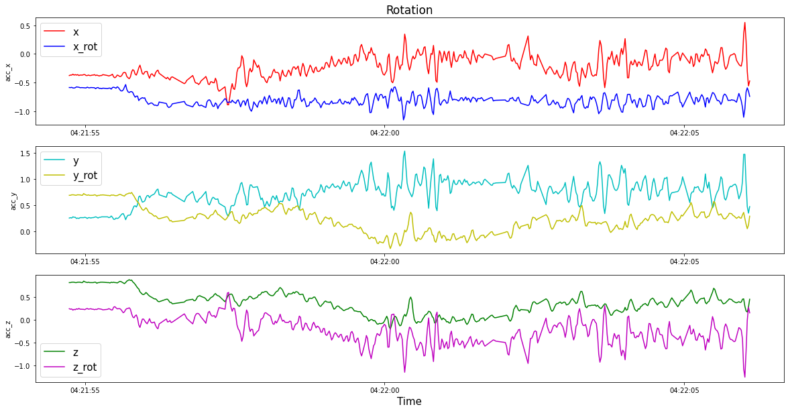

in progress....

## Data Augmentation in Epileptic Seizure Detection based on 3D Acceleration, Heart Rate and Temperature

Epilepsy, characterized by recurrent seizures, poses a significant risk to the individual’s safety. To mitigate
these risks, one approach is using automated seizure detection systems based on Convolutional Neural Networks
(CNNs) which rely on large amounts of data to train effectively. However, real-world seizure data
acquisition is challenging due to the short and infrequent nature of seizures, resulting in a data imbalance.

In this work, data augmentation techniques: Standard time series data augmentation techniques and Generative Adversarial Networks
(GANs) - based augmentation is utilized to increase the training dataset for CNNs, aiming for high sensitivity and low false alarm rates in the detection of epileptic seizures. For this purpose, the wearable sensor dataset is prepared into two datasets,

*- one with five features (3D acceleration, heart rate, and temperature)* and another

*- with three features(only 3D acceleration)* are used.

  
 For results comparison, CNN trained without augmented data is used
 as a baseline.

### Data Augmentation
Data augmentation is a technique that artificially increases the size of a dataset by creating
modified versions of existing data. It is particularly helpful in the context of imbalanced
dataset distributions commonly found in real-world applications. It allows additional
data to be generated for underrepresented classes, creating a more balanced dataset.
Studies have shown that data augmentation techniques can improve the generalizability
of deep learning networks, thereby reducing overfitting and enabling the networks to handle
imbalanced datasets more effectively.
These techniques include basic approaches that involve random transformations in
the time, frequency, and magnitude domains and advanced approaches that use Generative
Adversarial Networks (GANs) to generate synthetic time series.

### Standard Augmentation techniques

While the choice of data augmentation techniques depends on the
dataset’s properties and the task at hand, several basic techniques have been identified in
the area of time series data. Synthetic samples are generated by applying certain transformations
to the original samples, such as :

*- adding random noise (jittering)*

*- applying warping in time and magnitude (time warping, magnitude warping)*

*- rearranging segments (permutation) within the time series*

*- applying rotation matrices (rotation)* or

*- slicing (window slicing).*

Examples of random-transformation-based (standard) time series
data augmentation techniques are shown in the Figure below. 

**Implementation of Standard Augmentation techniques and augmented sample plots via each technique is available under the [Notebook](aug_plots.ipynb).**

These methods are applied to the extracted seizure events and the augmentation
process transforms the original seizure events to produce new synthetic samples. The original
seizure samples could contain missing time stamps, and the transformation is applied, 
including those missing time stamps. Following the augmentation, the augmented seizure
samples are divided into 10-second windows without any overlap ( samples for CNN training). The interpolation of
missing values is only performed during windowing after the samples have undergone a
transformation in the augmentation process. In contrast to the 15% interpolation threshold
used in the original data, the interpolation threshold is kept as low as 10% to preserve
more real data points of the augmented sample.

### Jittering
Noise is generated from a normal distribution with a mean of 0 and chosen standard deviation values of 0.2 and 0.5 to examine the effect of low and high noise levels on the performance of the
models. Choosing the right standard deviation ensures the jittered data reflects the original time series. A standard deviation that is too large may distort the data, while too small may not add enough diversity.

### Rotation
Rotation is one of the augmentation techniques that can be applied only to acceleration
data in this work due to the label-invariant characteristics of different wearable sensor
placements among participants. For example, a reversed placement of the sensor can flip its readings while maintaining the same labels for the acceleration data. In this case, rotational
augmentation can be employed as a way of simulating various sensor placements. However, this approach is not suitable for heart rate and temperature data because
inverting their sign can result in changes to the label, generating unrealistic data.

### Permutation
In the implementation of Permutation, the original seizure sample is rearranged into a new
time series by dividing it into a specified number of segments and rearranging the order of
the segments randomly. The number of segments N and the minimum segment length are both defined hyperparameters.
In this work, N is tested at values of 2, 3, and 5, while the minimum segment
length is fixed at 10.

### Time Warping
The time warping is applied to the original time series sample by smoothly distorting the
time steps. First, the smooth cubic spline is generated using the knots with a mean of 0 and
a standard deviation of 0.2. The cumulative graph is formed using the cumulative sum
of the cubic splines and the scaling is done to match the original sample size. The final
cumulative time stamps are then used to perform linear interpolation on the original
acceleration data to generate the time-warped version of the data.

### Magnitude Warping 
Magnitude warping involves modifying the magnitude or amplitude of the original signal
by convolving it with smooth warping curves. These warping curves are generated using
a cubic spline interpolation method and their shape is determined by a set of randomly
generated knots and the shape of input data. In this work, the number of knots is 4, and
they are generated from a random normal distribution with a mean of 1 and a standard
deviation of 0.2.

### Window Slicing
Window slicing is an augmentation technique in time series analysis that selects a portion of the data as a representative window. In this approach, the data is cropped to 90% of its original length, with the starting point chosen randomly and 10% removed from either end. For direct comparison with other methods, the cropped series is interpolated back to its original length.

